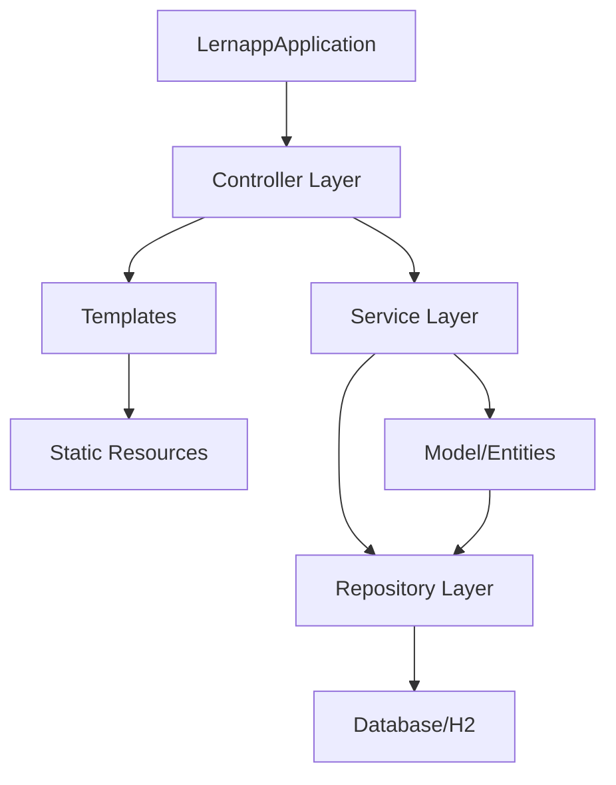

# 📁 PROJECT STRUCTURE - Fachinformatiker Lernapp Java
*Erstellt von Hans Hahn - Alle Rechte vorbehalten*
*Optimiert für Claude Code Integration*

## 🏗️ Verzeichnisstruktur

```
C:\SoftwareEntwicklung\Fachinformatiker_Lernapp_Java\
│
├── 📦 src/                          # Quellcode
│   ├── main/
│   │   ├── java/de/lernapp/
│   │   │   ├── 🚀 LernappApplication.java     # Hauptklasse
│   │   │   ├── config/                        # Konfigurationen
│   │   │   │   └── SecurityConfig.java        # Security Setup
│   │   │   ├── controller/                    # Web & API Controller
│   │   │   │   ├── HomeController.java        # Web Pages
│   │   │   │   └── api/                       # REST APIs
│   │   │   │       └── QuestionController.java
│   │   │   ├── model/                         # Entitäten
│   │   │   │   └── Question.java              # Fragen-Entity
│   │   │   ├── repository/                    # Datenzugriff
│   │   │   │   └── QuestionRepository.java    # JPA Repository
│   │   │   └── service/                       # Business Logic
│   │   │       ├── DataImportService.java     # CSV Import
│   │   │       └── QuestionService.java       # Fragen-Service
│   │   └── resources/
│   │       ├── 📝 application.yml             # Hauptkonfiguration
│   │       ├── 📝 application.properties      # Properties
│   │       ├── 📝 data.sql                    # Test-Daten
│   │       ├── static/                        # Statische Dateien
│   │       │   └── css/style.css
│   │       ├── templates/                     # HTML Templates
│   │       │   ├── index.html                 # Startseite
│   │       │   ├── home.html                  # Dashboard
│   │       │   ├── login.html                 # Anmeldung
│   │       │   ├── lernen.html                # Lernbereich
│   │       │   ├── uebungen.html              # Übungen
│   │       │   ├── pruefungen.html            # Prüfungen
│   │       │   └── fortschritt.html           # Fortschritt
│   │       └── data/                          # Daten-Import
│   │           └── ap1_questions/             # AP1 Fragen
│   └── test/                                   # Tests
│       └── java/de/lernapp/                   # Unit Tests
│
├── 📚 docs/                          # Dokumentation
│   ├── PROJECT_STRUCTURE.md         # Diese Datei
│   ├── CLAUDE_CODE_GUIDE.md         # Claude Code Anleitung
│   ├── API_DOCUMENTATION.md         # API Docs
│   └── ARCHITECTURE.md              # Architektur
│
├── 🔧 scripts/                       # Utility Scripts
│   ├── start.bat                    # App starten
│   ├── test.bat                     # Tests ausführen
│   └── build.bat                    # Projekt bauen
│
├── 📊 data/                          # Datendateien
│   ├── questions/                   # Fragen-CSV
│   └── import/                      # Import-Dateien
│
├── 🗄️ archive/                       # Archivierte Dateien
│   └── [alte/überflüssige Dateien]
│
├── 📋 Hauptdateien
│   ├── 📝 README.md                 # Projekt-Übersicht
│   ├── 📝 TODO.md                   # Aufgabenliste
│   ├── 📝 CHANGELOG.md              # Änderungsprotokoll
│   ├── 📝 error.log                 # Fehlerprotokoll
│   ├── 🔧 build.gradle              # Build-Konfiguration
│   ├── 🔧 settings.gradle           # Gradle Settings
│   └── 🔧 gradle.properties         # Gradle Properties
│
└── 🚫 .gitignore                    # Git Ignores
```

## 🔗 Abhängigkeiten & Verbindungen

### **Kern-Abhängigkeiten:**



### **Package-Struktur:**
```
de.lernapp
├── config          → Spring Configurations
├── controller      → Request Handling
│   └── api        → REST Endpoints
├── model          → Domain Objects
├── repository     → Data Access
├── service        → Business Logic
├── dto            → Data Transfer Objects [TODO]
├── exception      → Exception Handling [TODO]
└── util           → Utility Classes [TODO]
```

## 🎯 Claude Code Integration Points

### **Sprint-Arbeitsbereich:**
```
src/main/java/de/lernapp/  # Hauptarbeitsbereich
├── NEU ZU ERSTELLEN:
│   ├── model/User.java
│   ├── model/Role.java
│   ├── model/UserProgress.java
│   ├── repository/UserRepository.java
│   ├── service/AuthService.java
│   ├── service/UserService.java
│   ├── controller/api/AuthController.java
│   └── security/JwtTokenProvider.java
```

### **Test-Bereich:**
```
src/test/java/de/lernapp/
├── unit/               # Unit Tests
├── integration/        # Integration Tests
└── e2e/               # End-to-End Tests
```

## 📦 Build & Dependencies

### **Gradle Dependencies (build.gradle):**
```gradle
dependencies {
    // Spring Boot Starters
    implementation 'org.springframework.boot:spring-boot-starter-web'
    implementation 'org.springframework.boot:spring-boot-starter-data-jpa'
    implementation 'org.springframework.boot:spring-boot-starter-security'
    implementation 'org.springframework.boot:spring-boot-starter-validation'
    implementation 'org.springframework.boot:spring-boot-starter-thymeleaf'
    
    // Database
    runtimeOnly 'com.h2database:h2'
    runtimeOnly 'org.postgresql:postgresql'
    
    // Utilities
    compileOnly 'org.projectlombok:lombok'
    annotationProcessor 'org.projectlombok:lombok'
    
    // JWT
    implementation 'io.jsonwebtoken:jjwt-api:0.11.5'
    runtimeOnly 'io.jsonwebtoken:jjwt-impl:0.11.5'
    runtimeOnly 'io.jsonwebtoken:jjwt-jackson:0.11.5'
    
    // Testing
    testImplementation 'org.springframework.boot:spring-boot-starter-test'
    testImplementation 'org.springframework.security:spring-security-test'
}
```

## 🚀 Quick Commands

### **Für Claude Code:**
```bash
# Projekt starten
./scripts/start.bat

# Tests ausführen
./gradlew test

# Projekt bauen
./gradlew build

# Datenbank-Console öffnen
# Browser: http://localhost:8080/h2-console
# JDBC URL: jdbc:h2:mem:testdb
# Username: sa
# Password: (leer)
```

## 📊 Aktuelle Metriken

```
Dateien gesamt:     ~50
Java-Klassen:       8
Templates:          7
Test Coverage:      0% (TODO)
API Endpoints:      5
Datenbank-Tabellen: 2
```

## 🔍 Wichtige Dateien für Claude Code

### **Immer prüfen/aktualisieren:**
1. `TODO.md` - Aktuelle Aufgaben
2. `CHANGELOG.md` - Änderungen dokumentieren
3. `error.log` - Fehler protokollieren

### **Hauptarbeitsbereich:**
1. `src/main/java/de/lernapp/` - Java Code
2. `src/main/resources/templates/` - HTML Templates
3. `src/test/java/de/lernapp/` - Tests

## 🎨 Code-Standards

```java
// Package-Konvention
package de.lernapp.[layer].[feature];

// Klassen-Naming
public class UserService { }      // Services
public class UserController { }   // Controller
public class User { }             // Entities
public class UserRepository { }   // Repositories

// Methoden-Naming
public User findById(Long id)     // Englisch
// Geschäftslogik kommentieren auf Deutsch
```

## 🔄 Git Workflow

```bash
# Feature Branch erstellen
git checkout -b feature/user-authentication

# Änderungen committen
git add .
git commit -m "feat: User Authentication implementiert"

# Push to Remote
git push origin feature/user-authentication
```

---
*Letzte Aktualisierung: 19.08.2025*
